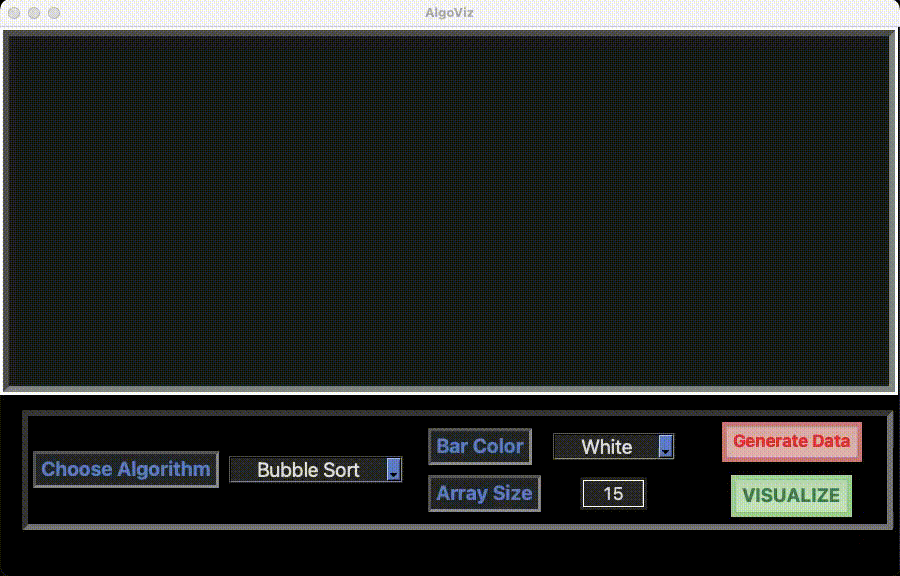

# AlgorithmViz
This is a visualiser interface to visualize how searching and sorting algorithms work. Searching algorithms like Jump Search, Linear Search, Binary Search and sorting algorithms like bubble sort, quick sort, selection sort, insertion sorting can be visualised

